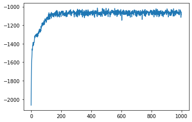

# Cipher Decryptor

A substitution cipher decryption algorithm using Natural Language Processing techniques and Genetic Algorithm 

## Gradient Ascent Metrics

## Requirements

Python 3 and necessary libraries given in requirements.txt 

Install the required libraries using the [pip](https://pip.pypa.io/en/stable/) package manager.

For pip version 19.1 or above:

~~~bash
pip install -r requirements.txt --user
~~~

or

~~~bash
pip3 install -r requirements.txt --user
~~~

## Future Scopes

* Consider alpha-numeric characters for decrypting
* Threading and GPU support for faster decryption
* Decryption for more types of ciphers